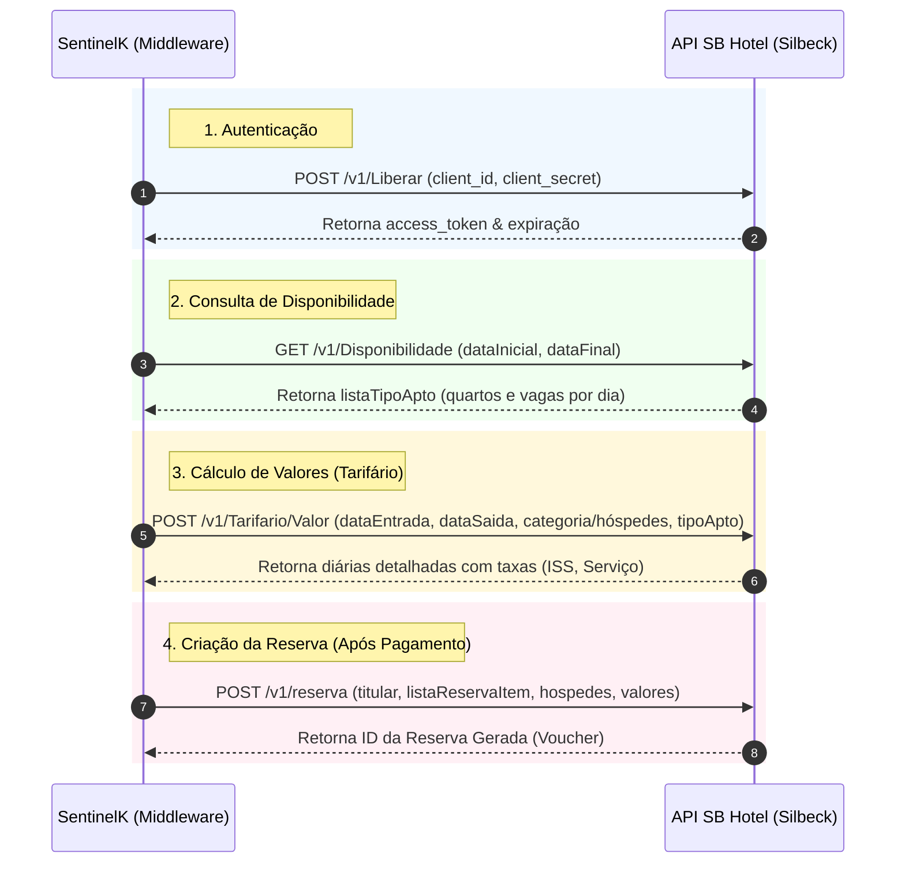

# Análise da API SB Hotel (Silbeck) para Automação de Reservas

Este documento apresenta a análise técnica da API do **SB Hotel (Silbeck)** (`https://developers.silbeck.com.br/api/hotel/v1/`) com foco nos requisitos e no fluxo necessários para automatizar a reserva de clientes no ecossistema do Middleware **SentinelK**.

---

## 1. Visão Geral da API

A API do SB Hotel é uma API RESTful projetada para integração direta com o PMS (Property Management System) do hotel. Ela expõe endpoints para consulta de disponibilidade, tarifação, cadastros e, principalmente, a criação e gerenciamento de reservas.

*   **URLs Base:**
    *   Produção/Homologação em Nuvem: `http://cloud.silbeck.com.br:30503/datasnap/rest`
    *   Ambiente Local/Desenvolvimento: `http://localhost:8366/datasnap/rest`
*   **Formato de Dados:** JSON (`application/json`) para a maioria das requisições e `application/x-www-form-urlencoded` para autenticação.

---

## 2. Fluxo Proposto para Automação de Reservas

Para integrar o SB Hotel ao motor de checkout do SentinelK, o fluxo de automação seguirá 4 etapas principais:



---

## 3. Detalhamento dos Endpoints Relevantes

### A. Autenticação e Autorização
*   **Endpoint:** `POST /v1/Liberar`
*   **Parâmetros (Query):**
    *   `client_id` (string, obrigatório): ID do cliente/parceiro.
    *   `client_secret` (string, obrigatório): Chave secreta do parceiro.
*   **Retorno (JSON):**
    ```json
    {
      "access_token": "eyJhbG...",
      "token_type": "Bearer",
      "expires_in": 3600
    }
    ```
*   *Nota: O token retornado deve ser enviado nos cabeçalhos (`Authorization: Bearer <token>`) de todas as demais requisições.*

### B. Consulta de Disponibilidade
*   **Endpoint:** `GET /v1/Disponibilidade`
*   **Parâmetros (Query):**
    *   `dataInicial` (string `yyyy-mm-dd`, obrigatório)
    *   `DataFinal` (string `yyyy-mm-dd`, obrigatório)
    *   `DetalharDiaADia` (boolean, opcional, padrão: `true`)
*   **Estrutura de Retorno Relevante:**
    Retorna uma lista de tipos de apartamento (`listaTipoApto`), onde cada tipo contém um array com a situação dia a dia:
    ```json
    {
      "listaTipoApto": [
        {
          "id": 5,
          "codigo": "LUXO",
          "nome": "Apartamento Luxo",
          "qtdeMapa": 10,
          "listaSituacaoTipoApto": [
            {
              "data": "2026-06-01",
              "qtdeDisponivel": 3,
              "qtdeOcupado": 7,
              "qtdeManutencao": 0
            }
          ]
        }
      ]
    }
    ```

### C. Cálculo de Tarifas Dinâmicas
*   **Endpoint:** `POST /v1/Tarifario/Valor`
*   **Payload (JSON Body):**
    ```json
    {
      "dataEntrada": "2026-06-01",
      "dataSaida": "2026-06-05",
      "quantidadeAdulto": 2,
      "quantidadeCrianca": 1,
      "idTipoApartamento": 5
    }
    ```
*   **Retorno (JSON):**
    Uma lista contendo o valor da diária para cada dia do período solicitado:
    ```json
    [
      {
        "data": "2026-06-01",
        "valor": 450.00,
        "valorTaxaServico": 45.00,
        "valorTaxaISS": 22.50
      },
      ...
    ]
    ```

### D. Criação da Reserva
*   **Endpoint:** `POST /v1/reserva`
*   **Payload (JSON Body - Simplificado):**
    ```json
    {
      "titular": "João da Silva",
      "email": "joao@email.com",
      "telefone": "(48) 99999-9999",
      "listaReservaItem": [
        {
          "idTipoApartamento": 5,
          "quantidadeAdulto": 2,
          "quantidadeCrianca": 1,
          "dataEntrada": "2026-06-01",
          "dataSaida": "2026-06-05",
          "qtdeApartamento": 1,
          "valorTotalDiaria": 1800.00,
          "listaHospede": [
            {
              "nome": "João da Silva",
              "adulto": true
            },
            {
              "nome": "Maria da Silva",
              "adulto": true
            }
          ],
          "listaData": [
            {
              "data": "2026-06-01",
              "valorDiaria": 450.00
            }
            // Demais dias...
          ]
        }
      ]
    }
    ```
*   **Retorno (JSON):**
    ```json
    {
      "id": "12345" // ID da Reserva no PMS
    }
    ```

---

## 4. Análise Crítica e Desafios para Automação (Hold vs. Commit)

O principal desafio encontrado na API do SB Hotel é a **ausência de um fluxo de Hold (Bloqueio Temporário) com Rollback/Cancelamento nativo** na especificação pública.

> [!WARNING]
> ### Ausência de Cancelamento via API
> A especificação não lista um endpoint `DELETE /v1/reserva` ou `POST /v1/reserva/cancelar`. O único endpoint de status é o `GET /v1/ListaReserva` que apenas lê o status (0 - Em andamento, 1 - Não confirmada, 2 - Confirmada, 3 - Cancelada, 4 - Check-in Efetuado, 5 - No-Show).
> Isso significa que **não é possível fazer um Rollback automatizado via API em caso de expiração do PIX** se a reserva já tiver sido inserida.

### Estratégias Recomendadas para o SentinelK:

Para mitigar o risco de overbooking e garantir a transacionalidade sem causar reservas fantasmas (ghost bookings), sugerimos duas abordagens:

1.  **Abordagem Soft Lock (Recomendada):**
    *   **Durante o checkout:** Consultar `/v1/Disponibilidade` para validar que existem quartos suficientes.
    *   **Não criar a reserva imediatamente.** Gerar o QR Code do PIX apenas com a validação local temporária do SentinelK.
    *   **No momento da confirmação do pagamento (Webhook MercadoPago):**
        *   Disparar o `POST /v1/reserva` para efetivar a reserva imediatamente.
        *   *Risco:* Se a última vaga for vendida por outro canal entre o checkout do cliente (geração do PIX) e a confirmação do pagamento (máximo de 10-15 minutos), haverá falha de emissão.
        *   *Solução:* Caso o `POST /v1/reserva` retorne erro de falta de disponibilidade no momento do pagamento, o SentinelK deve estornar o PIX automaticamente e notificar o suporte/cliente.
2.  **Abordagem Hard Lock (Se houver endpoint oculto/manual):**
    *   Confirmar com a Silbeck se existe um endpoint de cancelamento/inativação de reserva não listado no Swagger (por exemplo, `POST /v1/reserva/cancelar` ou alteração de status via PUT).
    *   Se existir, podemos criar a reserva imediatamente no checkout com status "Não confirmada" (1) e, caso o pagamento expire, enviar a chamada de cancelamento.

---

## 5. Como Implementar no SentinelK (Estrutura do Driver)

No SentinelK, podemos criar um novo driver `SilbeckDriver.ts` estendendo a interface comum de hotelaria:

```typescript
import { HotelDriver, HotelCartItem } from './HotelDriver';

export class SilbeckDriver implements HotelDriver {
  private baseUrl: string;
  private clientId: string;
  private clientSecret: string;

  constructor(config: any) {
    this.baseUrl = config.baseUrl;
    this.clientId = config.clientId;
    this.clientSecret = config.clientSecret;
  }

  // Consulta de disponibilidade na API Silbeck
  async checkAvailability(item: HotelCartItem): Promise<boolean> {
    // 1. Autenticar via /v1/Liberar
    // 2. Chamar GET /v1/Disponibilidade
    // 3. Validar se a quantidade de quartos livres atende à demanda para todas as datas
    return true; 
  }

  // No modelo Soft Lock, holdRoom apenas valida e retorna um token local
  async holdRoom(item: HotelCartItem): Promise<string> {
    // Se usarmos Soft Lock: gera um hash temporário local
    // Se houver suporte a reserva pendente na API: insere a reserva e retorna o ID dela
    return 'temp-token-local';
  }

  // Confirmação final da reserva
  async confirmReservation(reservationToken: string, clientData: any, item: HotelCartItem): Promise<boolean> {
    // Dispara o POST /v1/reserva com os dados do cliente e quarto
    // Retorna true em caso de sucesso
    return true;
  }

  // Rollback / Cancelamento
  async releaseRoom(reservationToken: string): Promise<boolean> {
    // Executa cancelamento na API (se suportado) ou apenas invalida o token local
    return true;
  }
}
```

---

## 6. Próximos Passos
1.  **Alinhamento de Negócio:** Confirmar com a equipe de negócios ou suporte técnico da Silbeck se existe um endpoint de cancelamento/exclusão de reserva para o fluxo de rollback.
2.  **Obtenção de Credenciais de Homologação:** Solicitar um `client_id` e `client_secret` de teste para o ambiente `http://cloud.silbeck.com.br:30503`.
3.  **Implementação do Driver:** Codificar o `SilbeckDriver.ts` na pasta `backend/src/drivers/` e registrá-lo no `SentinelK.ts`.
