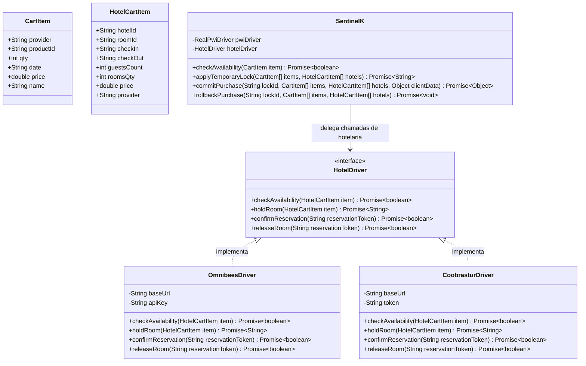
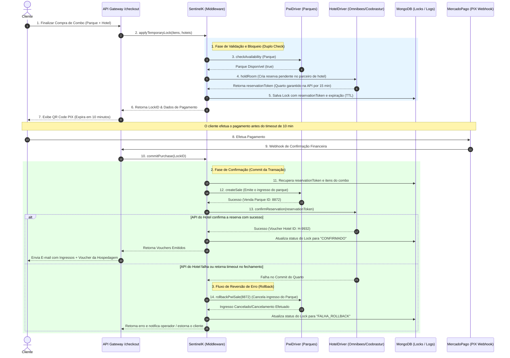

# Plano de Implantação: Integração com Hotéis (Channel Manager) no SentinelK

Este documento apresenta a arquitetura, o fluxo de execução e o plano de implementação detalhado para estender o Middleware de Bilhetagem **SentinelK** para suportar a integração de hotéis e hospedagens de forma robusta e transacional, garantindo a consistência na venda de combos "Parque + Hotel" sem risco de overbooking.

---

## User Review Required

> [!IMPORTANT]
> **Modelo de Reserva de Quarto de Hotel (Hard Lock):** 
> Diferente dos parques onde a vaga é apenas consultada (Soft Lock local) e emitida ao confirmar o pagamento, os hotéis operam com alta volatilidade de estoque e tarifas dinâmicas. 
> Por isso, a integração fará um **Bloqueio Físico Temporário na API do Hotel (Hold)** com validade (TTL) de 10 a 15 minutos durante o fluxo de pagamento. Caso o PIX expire, precisamos disparar um evento de liberação para liberar o estoque do hotel.

> [!WARNING]
> **Fluxo de Cancelamento/Rollback em Cascata:**
> Em compras combinadas (Parque + Hotel), caso o ingresso do parque seja emitido com sucesso mas a API do hotel retorne erro de rede no instante do fechamento final (Commit), o SentinelK executará o estorno (Rollback) automático do ingresso do parque para evitar a entrega de um "pacote pela metade".

---

## Open Questions

> [!IMPORTANT]
> 1. **Qual canal/provedor de hotelaria devemos priorizar na primeira sprint da Fase 2?** Temos no ecossistema as referências da **Coobrastur API** e da **Omnibees** (via Padrão OTA/Soap/Rest).
> 2. **Qual é o tempo limite (Timeout) desejável para o bloqueio do quarto no checkout?** Hotéis costumam limitar o tempo de reserva pendente de pagamento em 10 minutos. Devemos alinhar o tempo de expiração do QR Code de pagamento (PIX) com esse mesmo limite?

---

## Arquitetura do Ecossistema de Hotéis

### 1. Diagrama de Classes UML (Modelagem)

O diagrama a seguir descreve a estrutura de classes, estendendo o SentinelK com um driver abstrato de hotelaria e provedores específicos.

---

### 2. Diagrama de Sequência UML (Fluxo de Venda de Combo Anti-Overbooking)

Demonstra como o SentinelK gerencia transacionalmente a reserva simultânea de Parque + Hotel, tratando falhas de forma segura.

---

## Proposed Changes

### Componente Backend (Middleware SentinelK)

Para acomodar a lógica de hotéis, criaremos interfaces e estenderemos o motor SentinelK para orquestrar os cartões híbridos.

#### [NEW] [HotelDriver.ts](file:///c:/Users/Hiko/Documents/PROJETOS%20ANTIGRAVITY/MiddlewareRM/backend/src/drivers/HotelDriver.ts)
Criação da interface unificada para os drivers de hotelaria.
* Métodos padrão: `checkAvailability`, `holdRoom` (Bloqueio), `confirmReservation` (Commit), `releaseRoom` (Rollback/Cancel).

#### [NEW] [OmnibeesDriver.ts](file:///c:/Users/Hiko/Documents/PROJETOS%20ANTIGRAVITY/MiddlewareRM/backend/src/drivers/OmnibeesDriver.ts)
Implementação da interface baseada nos endpoints REST/SOAP da Omnibees.
* Tratamento de autenticação via Token, busca de disponibilidade por tarifas dinâmicas e gerenciamento de reservas temporárias.

#### [NEW] [CoobrasturDriver.ts](file:///c:/Users/Hiko/Documents/PROJETOS%20ANTIGRAVITY/MiddlewareRM/backend/src/drivers/CoobrasturDriver.ts)
Implementação da interface baseada na API da Coobrastur.
* Mapeamento de categorias e envio de payloads com base no `hotels_catalog.json` local.

#### [MODIFY] [SentinelK.ts](file:///c:/Users/Hiko/Documents/PROJETOS%20ANTIGRAVITY/MiddlewareRM/backend/src/services/SentinelK.ts)
Modificação na classe central do orquestrador:
* Inclusão do tipo `HotelCartItem`.
* Atualização do método `applyTemporaryLock` para validar estoque nos parques e, ao mesmo tempo, disparar o `holdRoom` no driver do hotel associado.
* Atualização do método `commitPurchase` para realizar o commit duplo (emite o ticket e confirma a reserva no hotel de forma coordenada).
* Criação de lógica de compensação de erros (se a emissão do hotel falhar após emissão do parque, executa rollback de catraca).

#### [NEW] [HotelLock.ts](file:///c:/Users/Hiko/Documents/PROJETOS%20ANTIGRAVITY/MiddlewareRM/backend/src/models/HotelLock.ts)
Modelo de dados do Mongoose para salvar os bloqueios de hotel no banco MongoDB central:
* Atributos: `lockId`, `reservationToken`, `hotelId`, `roomId`, `checkIn`, `checkOut`, `status` ("PENDENTE", "CONFIRMADO", "LIBERADO", "ERRO"), `createdAt` (com índice de expiração TTL de 15 minutos para limpeza automática).

---

## Verification Plan

### Automated Tests
1. **Mock Test Suite (`test_hotel_lock.ts`):** 
   Criar script de teste que simula o fluxo do checkout:
   * Dispara o `applyTemporaryLock` e valida se o token de reserva provisória foi gerado e persistido no MongoDB.
   * Simula a confirmação do pagamento e verifica a chamada de commit nos drivers de teste.
2. **Rollback Verification Suite (`test_hibrido_rollback.ts`):**
   * Simula um cenário onde o parque aprova a venda, mas o driver de hotel força um erro de conexão.
   * Valida se a chamada de cancelamento no driver do parque foi executada com sucesso e registrada nos logs de conciliação.

### Manual Verification
1. **Verificação no Painel Admin (`b2b-restaurante.html` / `b2b-setup.html`):**
   * Verificar se novos hotéis cadastrados e seus respectivos bloqueios aparecem corretamente nas telas administrativas em tempo de execução real.
   * Validar se o Mongo Express (`http://localhost:8081`) mostra a inserção dos documentos na collection `hotellocks` com o TTL correto de expiração.
