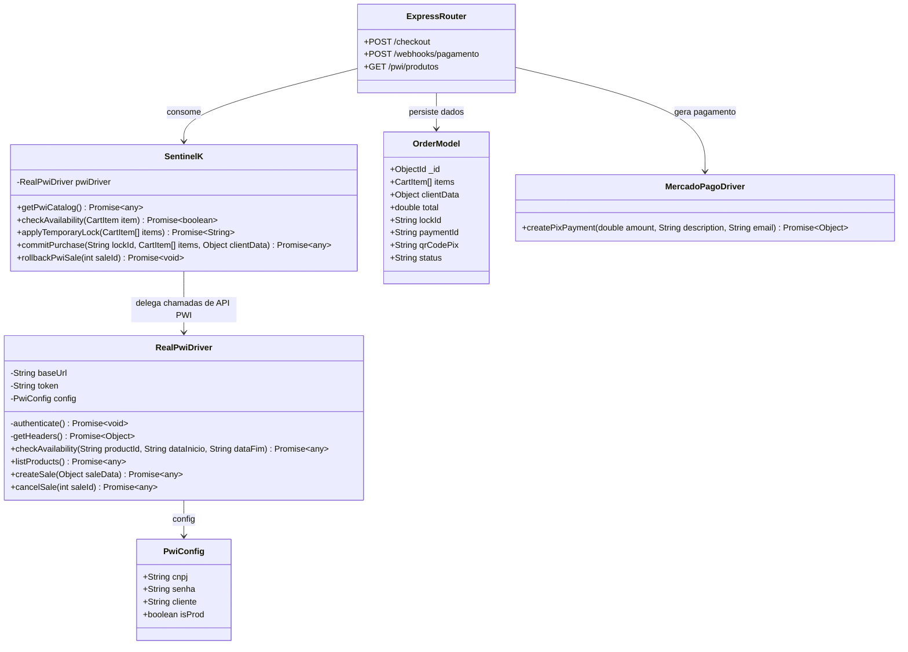
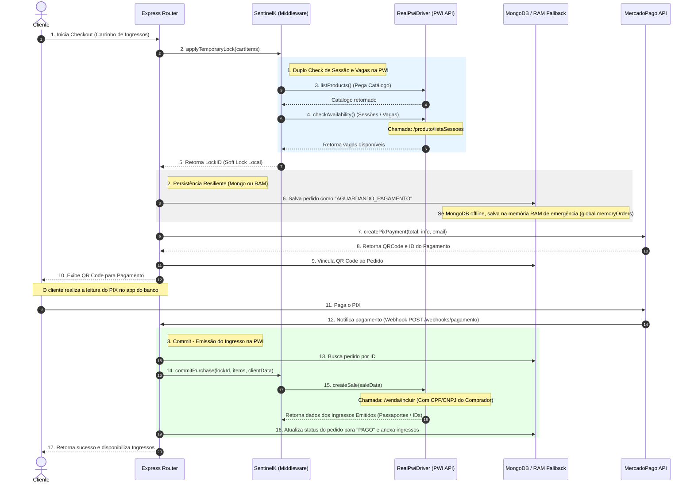

# Plano de Implantação e Arquitetura: Integração de Parques (PWI Driver) no SentinelK

Este documento detalha o funcionamento, fluxo transacional e a modelagem da integração real com os parques da **PWI** conforme implementado no middleware **SentinelK**.

---

## Estrutura da Integração Atual

A integração com a PWI foi desenhada para atuar em duas fases complementares (Passo 1: Bloqueio Temporário / Geração de PIX e Passo 2: Webhook / Emissão Final), adicionando resiliência ao banco MongoDB em cenários de instabilidade local e simulações inteligentes para o ambiente de Sandbox.

### 1. Diagrama de Classes UML (Modelagem Real)

Abaixo está mapeada a estrutura de arquivos e dependências em execução no diretório `backend`:

---

### 2. Diagrama de Sequência UML (Fluxo de Compra e Emissão)

O diagrama abaixo detalha o ciclo de vida completo de uma venda de ingresso da PWI no SentinelK, desde a adição ao carrinho até a notificação de confirmação via webhook:

---

## Detalhes de Implementação Críticos do Driver PWI

1. **Gestão Inteligente de Sessões (Prevenção de Erros 500 no Sandbox):**
   * A API da PWI retorna erro HTTP 500 (interno) caso um produto não tenha sessões abertas no período pesquisado. O `RealPwiDriver` captura esse caso de forma proativa. Se o cliente for configurado como `pwi_teste` (ambiente sandbox), ele injeta dinamicamente **100 vagas falsas simuladas** para que o fluxo de checkout não seja interrompido para fins de homologação. Em produção, ele retorna um array vazio (sinalizando esgotado).
2. **Resiliência Bancária contra Quedas de Banco (Fallback RAM):**
   * Se o container MongoDB do Docker estiver fora do ar localmente (problema comum ao reiniciar o Docker no Windows), a rota de checkout redireciona automaticamente o armazenamento do pedido para a memória RAM (`global.memoryOrders`), permitindo continuar os testes de integração do webhook de pagamento de ponta a ponta sem interrupções.
3. **Mecanismo de Rollback:**
   * Caso a chamada para a PWI falhe ou o processo precise ser desfeito, o `RealPwiDriver` possui o método `cancelSale(saleId)` que executa um request PUT em `/venda/cancelar/${saleId}`, invalidando os ingressos emitidos diretamente nas catracas do parque parceiro.
